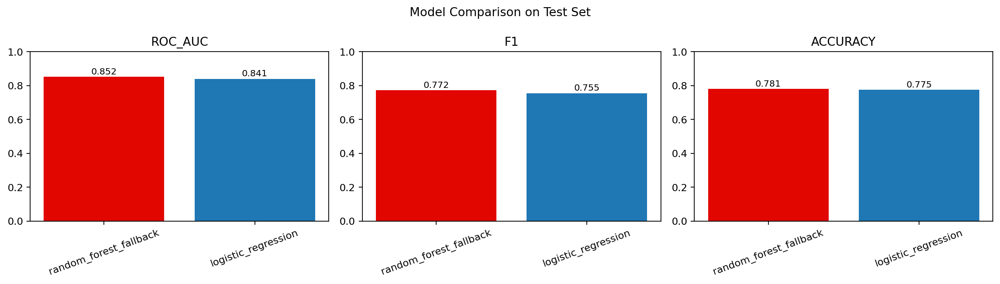
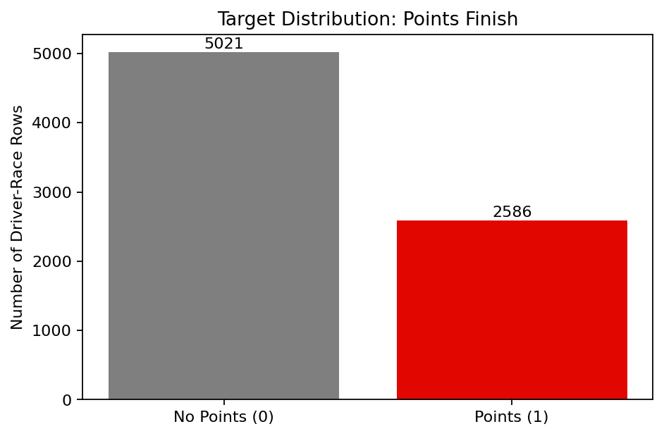
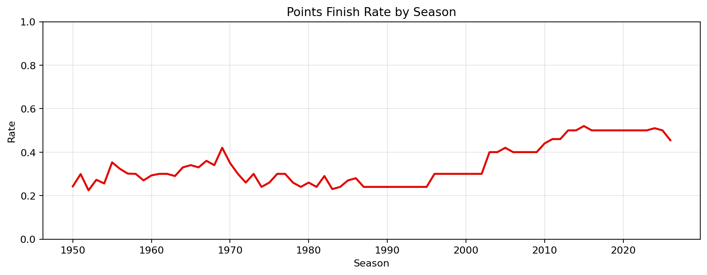

# F1 Race Prediction Model

This is an end-to-end Formula 1 ML project that predicts whether a driver will finish in points (`target_points`) for each race entry.

Built a full pipeline from raw API data to model training, evaluation, and visual reporting.

---

## What I Built

- data ingestion from Ergast-compatible APIs
- race + qualifying dataset builder
- rolling driver/team form feature engineering
- time-based train/test split (realistic forecasting setup)
- baseline model + tree-based model comparison
- automatic plots for result interpretation

---

## Data Source

- Ergast API: [http://ergast.com/mrd/](http://ergast.com/mrd/)
- Fallback mirror used in code for reliability: `api.jolpi.ca/ergast/f1`

Raw files are saved in `data/raw/`.

---

## Modeling Setup

### Target
- `target_points`: 1 if a driver scored points in the race, else 0.

### Features
- `grid`
- `qualifying_position`
- `driver_avg_finish_last5`
- `driver_avg_grid_last5`
- `driver_points_last5`
- `constructor_avg_finish_last5`
- `circuit_name`
- `constructor_name`

### Train/Test Split
- Train: seasons `<= 2021`
- Test: seasons `>= 2022`

---

## Final Results

Dataset size after processing:
- train rows: `7,141`
- test rows: `466`
- total rows: `7,607`

Model metrics on the test set:

| Model | ROC-AUC | F1 | Accuracy |
|---|---:|---:|---:|
| random_forest_fallback | 0.8518 | 0.7723 | 0.7811 |
| logistic_regression | 0.8407 | 0.7552 | 0.7747 |

Note: on this Mac, XGBoost could not load due to missing `libomp`, so the pipeline automatically used a Random Forest fallback.

---

## Graphs





Generated automatically by:
- `src/models/plot_results.py`

---

## Run the Project

```bash
python3 -m venv .venv
source .venv/bin/activate
pip install -r requirements.txt

python3 -m src.data.download_data --limit 2000
python3 -m src.data.build_dataset
python3 -m src.features.make_features
python3 -m src.models.train_baseline
python3 -m src.models.train_xgboost
python3 -m src.models.evaluate
python3 -m src.models.plot_results
```

---

## Repository Structure

```text
src/data/download_data.py      # pull race + qualifying data
src/data/build_dataset.py      # build modeling table + targets
src/features/make_features.py  # rolling feature engineering
src/models/train_baseline.py   # logistic regression baseline
src/models/train_xgboost.py    # xgboost with RF fallback
src/models/evaluate.py         # model ranking summary
src/models/plot_results.py     # graph generation
```

---

## Next Steps

- install `libomp` and run true XGBoost
- add podium/winner targets
- add weather and reliability features
- expose predictions through an API/dashboard
